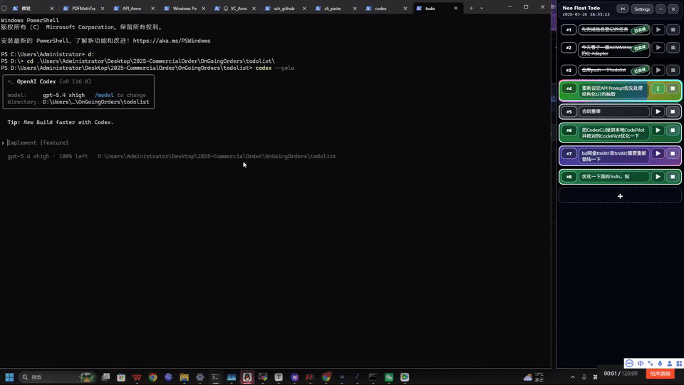

# cli-paste

<p align="center">
  A Windows helper that turns clipboard images into pasted file paths for Codex, Claude Code, and similar terminal-first workflows.
</p>

<p align="center">
  <a href="./demo.mp4">
    
  </a>
</p>

<p align="center">
  <sub>Click the GIF to open the full <code>demo.mp4</code> recording.</sub>
</p>

<p align="center">
  
  
  
  
</p>

<p align="center">
  
  
  
  
</p>

## Overview

`cli-paste` removes the manual save-copy-paste loop when a terminal AI tool needs an image path instead of a clipboard image. When `Ctrl+V` or terminal right-click happens in a supported terminal window and the clipboard contains an image, the app saves that image to disk and pastes the saved file path automatically.

It is built for Windows-first terminal workflows around tools such as Codex, Claude Code, and similar CLI environments.

## Highlights

- Converts clipboard images into pasted file paths with `Ctrl+V`
- Supports terminal right-click paste flow as well
- Ignores non-terminal windows and keeps normal text paste behavior intact
- Lets users customize the image cache directory from the GUI
- Can register a Windows Task Scheduler autostart entry
- Ships as plain Python source with a simple `start.bat` entry point

## Demo

- Inline README preview: [demo.gif](./demo.gif)
- Full recorded workflow: [demo.mp4](./demo.mp4)

## Tech Stack

<p>
  
  
  
  
</p>

## Quick Start

### Requirements

- Windows 10 or Windows 11
- Python 3.8+
- An interactive desktop session

### Clone and Run

```powershell
git clone https://github.com/phenixnull/cli-paste.git
cd cli-paste
start.bat
```

`start.bat` does the following:

1. Starts `dist\cli_paste.exe` if you already built a packaged release.
2. Otherwise finds Python, creates `.venv`, installs dependencies, and launches the GUI.

### Manual Setup

```powershell
py -3 -m venv .venv
.venv\Scripts\python -m pip install -r requirements.txt
.venv\Scripts\python gui.py
```

## Configuration

Environment variables:

- `CLI_PASTE_PYTHON`: full path to `python.exe` if Python is not on `PATH`
- `CLI_PASTE_PYTHONW`: optional full path to `pythonw.exe` for background launches
- `CLI_PASTE_PIP_INDEX_URL`: optional custom package index URL for dependency installation

Runtime settings:

- Default image cache path: `%USERPROFILE%\Pictures\CLI_temp`
- Open the GUI and click `Settings` to choose any writable folder for pasted images
- The selected cache path is saved to `%APPDATA%\cli_paste\settings.json`
- If the worker is already running, the GUI restarts it so the new cache path applies immediately
- `Run at login` creates a Windows Task Scheduler entry for the background worker

## Supported Terminals

The terminal detector uses both process names and window classes. It is intended to work with:

- Windows Terminal
- PowerShell and `pwsh`
- CMD
- Git Bash and mintty
- WSL shells
- WezTerm
- Alacritty
- Tabby
- Hyper
- Terminus

## Project Structure

```text
.
|-- app_config.py    Shared config helpers and persisted settings
|-- bootstrap.py     Creates or repairs the virtual environment and launches the GUI
|-- cli_paste.py     Keyboard and mouse hooks plus clipboard image handling
|-- gui.py           Start or stop UI, cache settings, and startup task management
|-- start.bat        Windows entry point for local use
|-- requirements.txt Runtime Python dependencies
|-- demo.gif         README preview animation
`-- demo.mp4         Bundled demo video linked from this README
```

## Repository Goal

This repository tracks the runtime app itself. Virtual environments, build output, logs, PID files, and machine-local cache data are intentionally excluded from Git.

## License

This project is licensed under `MIT`. See `LICENSE` for the full text.
